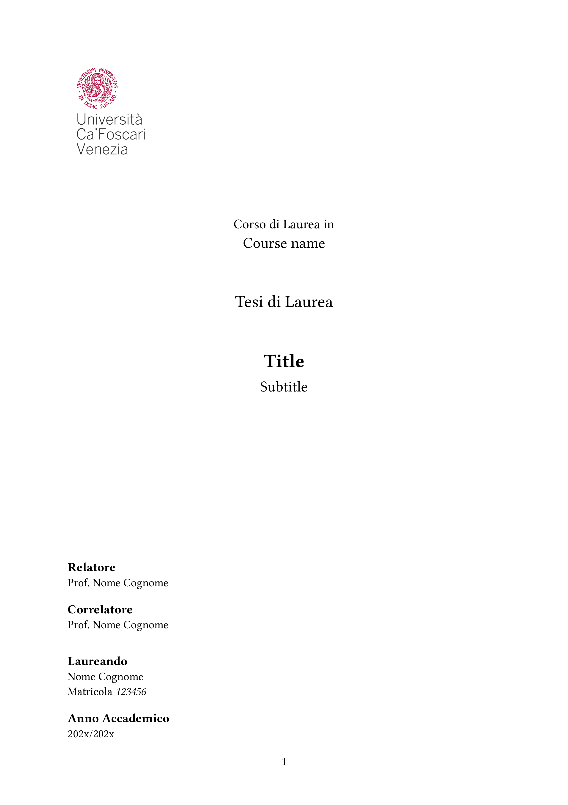

# Unive thesis template in typst

This is a basic template that follows the recommended format for theses at Ca' Foscari University (Unive), written in [Typst](https://typst.app/).

## Preview

<div align="center">
    
</div>

## Usage

Inside the `template` folder, there is the following example...

```typ
#import "@preview/simple-ve-thesis:0.1.0": template

#let bib = bibliography("./refs.bib")

#show: template.with(
  title: "Title",
  candidate: (
    name: "Nome Cognome",
    number: "123456",
  ),
  date: "202x/202x",
  course: "Course name",
  logo: image("images/Unive.svg", width: 20%),
  is-master: false, // Change the title if it is a bachelor's or master's thesis
  supervisor: "Prof. Nome Cognome",
  co-supervisor: "Prof. Nome Cognome",
  abstract: include "abstract.typ",
  lang: "it",
  bib: bib, // Pass the bibliography object instead of a file path
)

= Introduzione
#lorem(100)

== Parte uno
#lorem(100)

...
```
Considering having just the following files
```
example/
        main.typ
        refs.bib
        abstract.typ
        images/
               Unive.svg
```
Just compile the file with the command `typst compile main.typ`.
